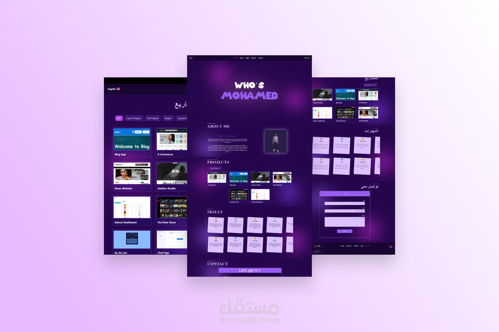

# Portfolio

This outstanding project offers a multilingual website, supporting both Arabic and English, providing a global user experience. The website is carefully designed to ensure a smooth and comfortable browsing experience for users from different cultures.



## Features

- **Multilingual Support**: The website supports both Arabic and English languages, catering to a diverse user base.
- **Global User Experience**: Designed to provide an exceptional user experience for users from different cultural backgrounds.
- **Smooth and Comfortable Browsing**: Ensures an easy and pleasant browsing experience for all users.

## Technologies Used

- **ReactJS**: Used as the JavaScript library for developing the dynamic user interface.
- **i18next**: For internationalization and language support.
- **react-router-dom**: This package was used for managing navigation between pages within the application.
- **Material UI**: The Material UI package was used to design and implement elegant and responsive user interface elements.

## Getting Started

To get started with the project, follow these steps:

1. **Clone the repository**
   ```bash
   git clone https://github.com/Mohammed-Shaaban-Ali/Portfolio.git
